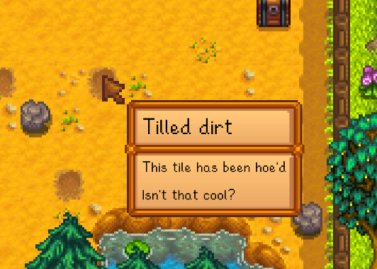

# Hover Labels

This mod lets you hover over things and shows you a neat little label with some information about it.

# Features

Types of labels:

* Chests
* Crops
* Fruit Trees
* Garden pots
* Greenhouse
* Junimo huts
* Machines: (any placed object that is processing items)
* Objects: (any placed object will have its name shown)
* Scarecrows
* Sprinklers

# Changelog

## Planned

* Add labels for Barns, Coops, Mills and other farm buildings if they are interesting
* Add option for smaller borders (similar to ones you get when hovering over items in inventory)
* Add additional box to label for "show more" types of things.

## 1.0.0

* Initial release

